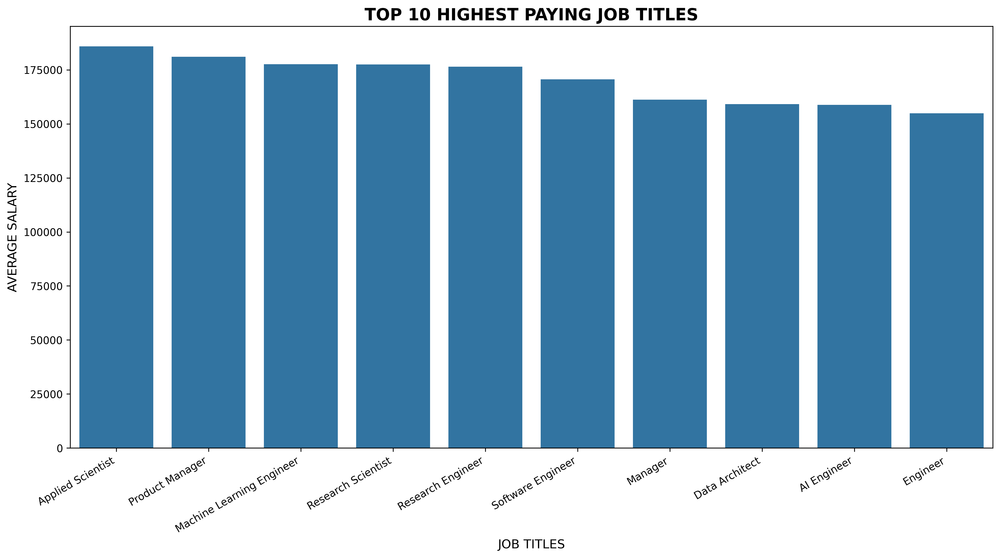
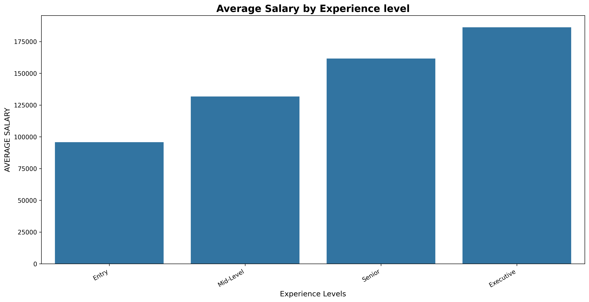
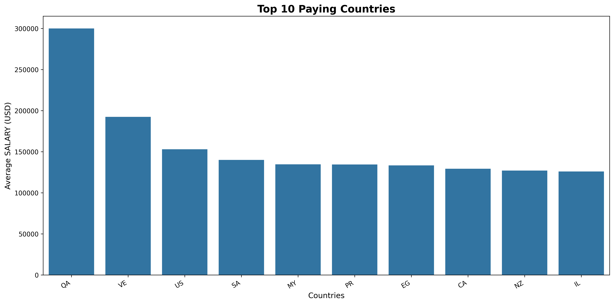
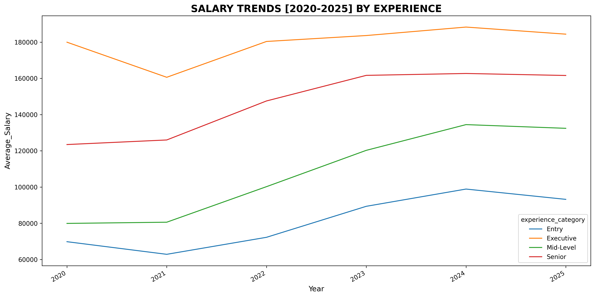
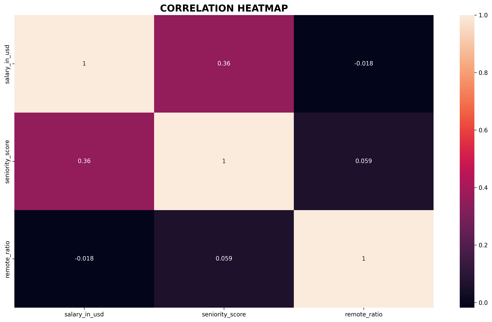

# 📊 Data Science Salary Analysis 2025

Analyzing **45,000+ Data Science salaries (2020–2025)** to uncover trends and build machine learning models for salary prediction.

---

## 📌 Dataset Overview

* **Rows:** 45,523
* **Years Covered:** 2020–2025
* **Target Variable:** `salary_in_usd`

### Features

* Experience Level
* Employment Type
* Job Title
* Company Size
* Remote Ratio
* Company Location

---

# 🛠 Technologies Used

* Python
* Pandas
* NumPy
* Matplotlib
* Seaborn
* Scikit-Learn

---

# 📈 Exploratory Data Analysis

## Top 10 Highest Paying Job Titles

---

## Salary by Experience Level

---

## Top 10 Paying Countries

---

## Salary Trends (2020–2025)

---

## Correlation Heatmap

---

# 🤖 Machine Learning Models

Implemented:

* Linear Regression
* Decision Tree Regressor
* Random Forest Regressor
* XGBoost Regressor

---

# 🔍 Key Insights

* Applied Scientist roles offer the highest average salaries.
* Senior and Executive professionals earn significantly more.
* Medium-sized companies provide competitive salaries.
* Remote and on-site salaries are nearly identical.
* Salary trends have increased over time.

---

⭐ If you found this project useful, consider giving it a star.
